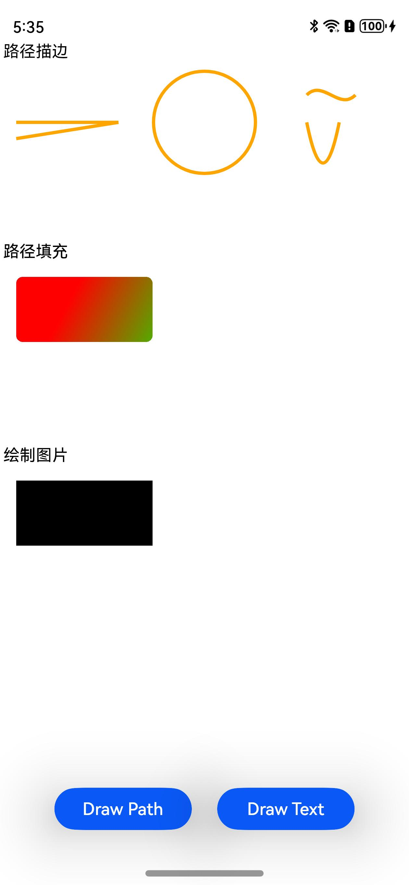

# Native Drawing

### 介绍

本示例中主要介绍开发者在利用Native XComponent来获取NativeWindow实例、获取布局/事件信息、注册事件回调并通过Drawing API实现在页面上绘制形状。功能主要包括点击按钮绘制几何图形，颜色，文字，图片，渐变填充，描边。

使用说明

1. 安装编译生成的hap包，并打开应用。

2. 点击页面底部“Draw Path”按钮，页面将绘制路径的描边，填充，几何图形和图片；

3. 点击页面底部“Draw Text”按钮，页面将绘制“Hello World”。

### 效果预览

| 主页                                 | 绘制路径                                         | 绘制文字                                            |
| ------------------------------------ |-----------------------------------------------| --------------------------------------------------- |
|  |  |  |

### 工程目录

```
├──entry/src/main
│  ├──cpp                           // C++代码区
│  │  ├──CMakeLists.txt             // CMake配置文件
│  │  ├──hello.cpp                  // Napi模块注册
│  │  ├──common
│  │  │  └──log_common.h            // 日志封装定义文件
│  │  ├──plugin                     // 生命周期管理模块
│  │  │  ├──plugin_manager.cpp
│  │  │  └──plugin_manager.h
│  │  ├──samples                    // samples渲染模块
│  │  │  ├──sample_bitmap.cpp
│  │  │  └──sample_bitmap.h
│  ├──ets                           // ets代码区
│  │  ├──entryability
│  │  │  ├──EntryAbility.ts         // 程序入口类
|  |  |  └──EntryAbility.ets
|  |  ├──interface
│  │  │  └──XComponentContext.ts    // XComponentContext
│  │  └──pages                      // 页面文件
│  │     └──Index.ets               // 主界面
|  ├──resources         			// 资源文件目录
```

### 具体实现

通过在IDE中创建Native c++ 工程，在c++代码中定义对外接口为drawPattern和drawText，在js侧调用该接口可在页面上绘制出路径样式、图片和“Hello World”文字。

在XComponent的OnSurfaceCreated回调中获取NativeWindow实例并初始化NativeWindow环境。调用OH_NativeXComponent_GetXComponentSize接口获取XComponent的宽高，并以此为输入调用Drawing相关的绘制接口在NativeWindow上绘制出图形和文字。

源码参考：[samples目录](entry/src/main/cpp/samples)下的文件。

涉及到的相关接口：


| 接口名 | 描述 | 
| -------- | -------- |
| OH_Drawing_BitmapCreate (void) | 创建一个位图对象。 |
| OH_Drawing_BitmapBuild (OH_Drawing_Bitmap *, const uint32_t width, const uint32_t height, const OH_Drawing_BitmapFormat *) | 初始化位图对象的宽度和高度，并且为该位图设置像素格式。 |
| OH_Drawing_CanvasCreate (void) | 创建一个画布对象。 |
| OH_Drawing_CanvasBind (OH_Drawing_Canvas *, OH_Drawing_Bitmap *) | 将一个位图对象绑定到画布中，使得画布绘制的内容输出到位图中（即CPU渲染）。 |
| OH_Drawing_CanvasAttachBrush (OH_Drawing_Canvas *, const OH_Drawing_Brush *) | 设置画刷给画布，画布将会使用设置的画刷样式和颜色去填充绘制的图形形状。 |
| OH_Drawing_CanvasAttachPen (OH_Drawing_Canvas *, const OH_Drawing_Pen *) | 设置画笔给画布，画布将会使用设置画笔的样式和颜色去绘制图形形状的轮廓。 |
| OH_Drawing_CanvasDrawPath (OH_Drawing_Canvas *, const OH_Drawing_Path *) | 画一个自定义路径。 |
| OH_Drawing_PathCreate (void) | 创建一个路径对象。 |
| OH_Drawing_PathMoveTo (OH_Drawing_Path *, float x, float y) | 设置自定义路径的起始点位置。 |
| OH_Drawing_PenCreate (void) | 创建一个画笔对象。 |
| OH_Drawing_PenSetAntiAlias (OH_Drawing_Pen *, bool) | 设置抗锯齿属性，如果为真则说明画笔会启用抗锯齿功能，在绘制图形时会对图形的边缘像素进行半透明的模糊处理。 |
| OH_Drawing_PenSetWidth (OH_Drawing_Pen *, float width) | 设置画笔的厚度属性，厚度属性描述了画笔绘制图形轮廓的宽度。 |
| OH_Drawing_BrushCreate (void) | 创建一个画刷对象。 |
| OH_Drawing_CreateTypographyStyle (void) | 创建一个排版对象，用于定义排版样式。 |
| OH_Drawing_CreateTextStyle (void) | 创建一个文本对象，用于定义文本样式。 |
| OH_Drawing_TypographyHandlerAddText (OH_Drawing_TypographyCreate *, const char *) | 设置文本内容。 |
| OH_Drawing_TypographyPaint (OH_Drawing_Typography *, OH_Drawing_Canvas *, double, double) | 显示文本。 |
| OH_Drawing_CanvasDrawLine (OH_Drawing_Canvas* , float x1, float y1, float x2, float y2 ) | 用于画一条直线段。 |
| OH_Drawing_PointCreate (float x, float y ) | 用于创建一个坐标点对象。 |
| OH_Drawing_CanvasDrawCircle (OH_Drawing_Canvas* , const OH_Drawing_Point* , float radius ) | 用于画一个圆形。 |
| OH_Drawing_PathCubicTo (OH_Drawing_Path* , float ctrlX1, float ctrlY1, float ctrlX2, float ctrlY2, float endX, float endY ) | 用于添加一条从路径最后点位置到目标点位置的三阶贝塞尔圆滑曲线。 |
| OH_Drawing_PathReset (OH_Drawing_Path* ) | 用于重置自定义路径数据。 |
| OH_Drawing_PathQuadTo (OH_Drawing_Path* , float ctrlX, float ctrlY, float endX, float endY ) | 用于添加一条从路径最后点位置到目标点位置的二阶贝塞尔圆滑曲线。 |
| OH_Drawing_CanvasDetachPen (OH_Drawing_Canvas* ) | 用于去除掉画布中的画笔，使用后画布将不去绘制图形形状的轮廓。 |
| OH_Drawing_ShaderEffectCreateLinearGradient (const OH_Drawing_Point* startPt, const OH_Drawing_Point* endPt, const uint32_t* colors, const float* pos, uint32_t size, OH_Drawing_TileMode  ) | 创建着色器，在两个指定点之间生成线性渐变。 |
| OH_Drawing_BrushSetShaderEffect (OH_Drawing_Brush* , OH_Drawing_ShaderEffect*  ) | 为画刷设置着色器效果。 |
| OH_Drawing_RectCreate (float left, float top, float right, float bottom ) | 用于创建一个矩形对象。 |
| OH_Drawing_RoundRectCreate (const OH_Drawing_Rect* , float xRad, float yRad ) | 用于创建一个圆角矩形对象。 |
| OH_Drawing_PathAddRoundRect (OH_Drawing_Path* , const OH_Drawing_RoundRect* roundRect, OH_Drawing_PathDirection  ) | 按指定方向，向路径添加圆角矩形轮廓。 |
| OH_Drawing_ImageCreate (void ) | 创建一个图片对象，描述了要绘制的二维像素数组。 |
| OH_Drawing_ImageBuildFromBitmap (OH_Drawing_Image* , OH_Drawing_Bitmap*  ) | 从位图构造图片对象内容，共享或复制位图像素。如果位图被标记为不可变状态， 像素内存是共享的，不是复制。 |
| OH_Drawing_SamplingOptionsCreate (OH_Drawing_FilterMode , OH_Drawing_MipmapMode  ) | 创建一个采样选项对象。 |
| OH_Drawing_CanvasDrawImageRect (OH_Drawing_Canvas* , OH_Drawing_Image* , OH_Drawing_Rect* dst, OH_Drawing_SamplingOptions*  ) | 将图片绘制到画布的指定区域上。 |
| OH_Drawing_CanvasDetachBrush (OH_Drawing_Canvas* ) | 用于去除掉画布中的画刷，使用后画布将不去填充图形形状。 |

详细的接口说明请参考[Drawing](https://gitee.com/openharmony/docs/blob/master/zh-cn/application-dev/reference/apis-arkgraphics2d/_drawing.md)。

### 相关权限

不涉及。

### 依赖

XComponent NativeWindow。

### 约束与限制

1. 本示例仅支持标准系统上运行。
2. 本示例为Stage模型，已适配API version 11版本SDK，SDK版本号(API Version 11 Release),镜像版本号(4.1 Release);
3. 本示例需要使用DevEco Studio 版本号(4.1 Release)及以上版本才可编译运行。
